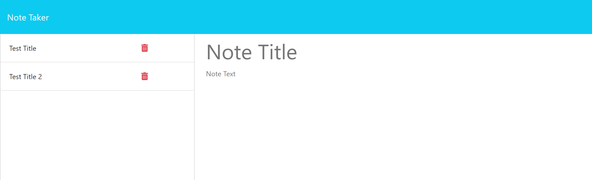

# Note Taker

## Description

The motivation for this project was to develop an application that used Express.js on the back end. This project allowed me to connect the back end to the front end through the use of routes, a get method and a post method. By connecting the front and back ends together, it gives the user the capability to save their notes in one area. It further gave me insight into creating a back-end server and how to connect that to the front end to create a functioning application. 

## Usage

After clicking the get started button, the user is able to create a new note by providing input to the empty title and text fields. Once the user chooses to save the note, then it will appear on the left hand side along with previously saved notes. 

    

    

